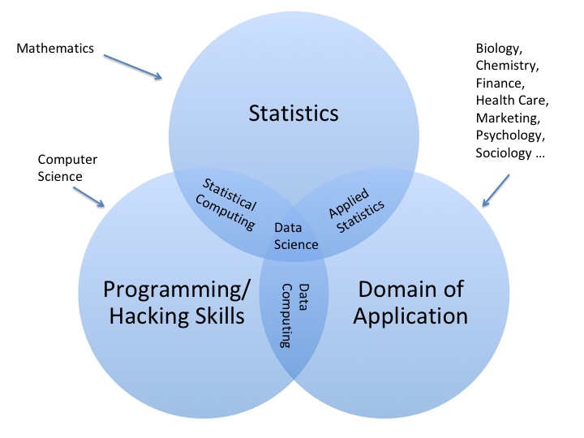
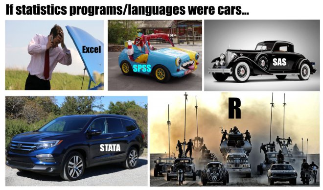

```{r include=FALSE}
knitr::opts_chunk$set(fig.align = "center")
```

<style>
blockquote {
  width: 80%;
  margin:  0 auto;
  background-color:  palegreen;
  padding:20px;
}
img {
  display: block;
  margin-left: auto;
  margin-right: auto;
}
body {
  background: linear-gradient(to bottom, #c9d6ff, #e2e2e2) !important;
}
slides > slide.backdrop {
  background:  none !important;
  background-color: white !important;
}
</style>

# Is Data Science a Science?

## Well, Is it?

Take a couple of minutes to jot down:

* at least one reason why Data Science is a science
* at least one reason why it isn't

## What is Science?

We will not approach this as a question in the philosophy of science (where the question is usually considered either unsolvable or uninteresting).

Let's just see how ordinary mortals try to answer it.

## What Google Says ...

... when you enter "science definition":

>*the intellectual and practical activity encompassing the systematic study of the structure and behavior of the physical and natural world through observation and experiment.*


## Wikipedia

>*Science is a systematic enterprise that builds and organizes knowledge in the form of testable explanations and predictions about the universe.*


## The Science Council

>*Science is the pursuit and application of knowledge and understanding of the natural and social world following a systematic methodology based on evidence.*

## What I Take From This

Three marks of a science:

* The object of study is a demarcated domain or aspect of the natural world:
    * in biology, it's organic life;
    * in physics, it's the fundamental constituents of the material universe and their interactions;
    * in chemistry, it's atoms in combination;
    * in sociology it's society (the pattern of social interactions/relationships between persons).
* There is (at least one) accepted method for acquiring and validating knowledge in this domain.
* Although applications are possible, they are not the standard of evaluation.

## Where do These Stand ...

... in relation to science?

* mathematics
* statistics
* computer science
* mechanical engineering
* data science

##



## For My Part ...

... I call it "data analysis", not "data science."

(ideally, anyway ...)

# Data Science in the Liberal Arts

## Not a Major

* lacks intellectual coherence
* too much a tool

But it could work nicely as a minor!

## History at Georgetown

1. Began as Data Analysis Minor, with two tracks:
    * Applied Statistics (calc-based)
    * Data Computing (heavily dependent on Computer Science offerings)
2. We lost our computer science major ...
3. ... and then our last computer scientist.
4. The College wanted something in the catalog to call Computer Science.
5. Someone agreed to retrain.

## Criteria

* a sense of closure (should not be a truncated CS major)
* an air of practicality
* appeal to students in many disciplines

So,

**Data Computing &rarr; Data Analysis &rarr; "Computer Science"**

## The Primary Language-Vehicle



## Courses

* Computer Science I  (R programming, procedural)
* Computer Science II (more R, functional/oo programming)
* Fundamentals of Data Computing
* Databases
* Web Design (HTML, CSS; offered by Art Dept)
* Web Programming (Javascript, [Data Vis](https://homerhanumat.github.com/bpexploder))

## The R Ecosystem

* R Studio Server
* R Markdown
* R Pubs
* Shiny
* terminal, git and Github
* **blogdown** package
* database connections through R Studio
* cloud services (Digital Ocean)

## Challenges

* mathematical preparation
* web designers
* IT issues (mostly in Web Programming)

## Resources

* [GC Computer Science](http://gccs.surge.sh)
* [Beginning Computer Science with R](https://homerhanumat.github.io/r-notes)
* [Modern Data Science with R](https://mdsr-book.github.io/)
* [Eloquent Javascript](https://eloquentjavascript.net/)


